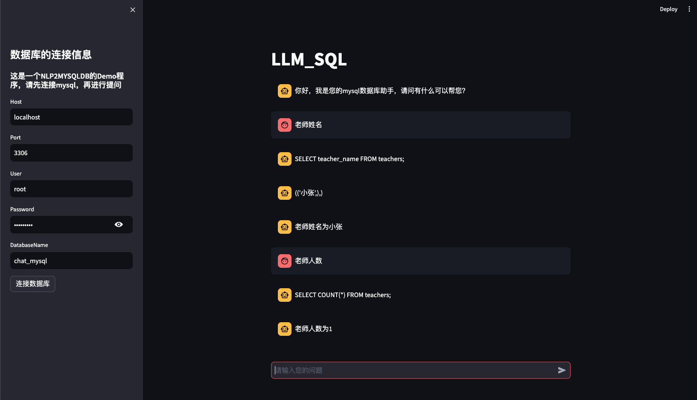
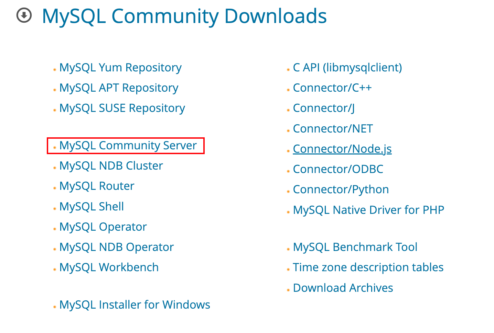

# Chat with MySQL

使用steamlit run app.py
即可启动webui
## 项目结构

config.py 配置文件

app_only_sql.py 是只返回sql语句的版本

可视化效果：

appv1.py 是返回sql语句和自然语言响应的版本,但目前存在一些问题，比如sql语句错误，自然语言尝试修改正确的sql语句。

tool.py 工具函数

app_agent.py 是agent版本，功能基本完成，但propmt仍然需要进行优化

## 环境配置

### MySQL的安装

开始本项目之前需要安装MySQL数据库，以下是MySQL的安装教程：
[MySQL的下载链接](https://dev.mysql.com/downloads/mysql/)

选择社区版本 然后根据操作系统的不同选择合适的版本就行。

具体过程可以参考其他教程，这里就不详细介绍了。

### NaviCat的安装

NaviCat 数据库可视化app

### streamlit 

streamlit 是一个用于构建Web应用程序的Python库。
## issue
- sql
  - 当用户指令不明确的时候，即模型无法拿到完整的待搜索字段的时候，应该采用sql中的模糊匹配link操作符来解决。
- nl
  - 模型在得到sql输出后，在计算部分存在问题，导致无法给出正确的自然语言响应。（150/0 应该是无穷大 或者无法计算，但模型给出的返回是150）