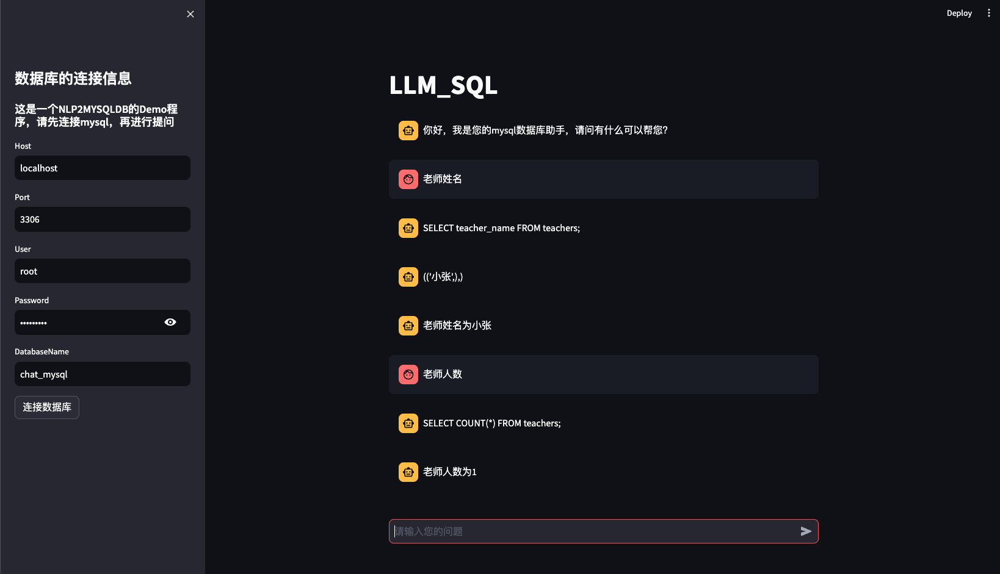
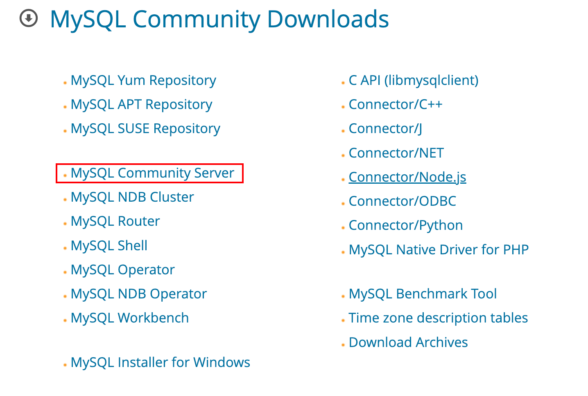

# Chat with MySQL

ps(熬不动了 先写到这)

可视化效果：

## MySQL的安装

开始本项目之前需要安装MySQL数据库，以下是MySQL的安装教程：
[MySQL的下载链接](https://dev.mysql.com/downloads/mysql/)

选择社区版本 然后根据操作系统的不同选择合适的版本就行。

具体过程可以参考其他教程，这里就不详细介绍了。

## NaviCat的安装

stramlit 以编写可视化页面

